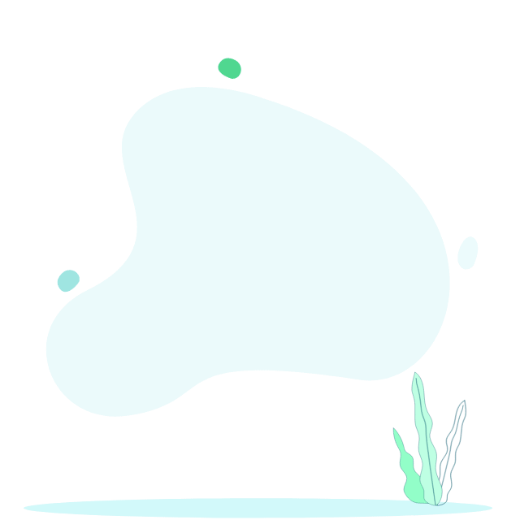

### &nbsp;Hey there! 

# I'm Hossein

### 👩‍💻 &nbsp;About Me

💻 &nbsp;I'm a Front-end Developer.\
💡 &nbsp;&nbsp;I'd like to use Creativity in the endless world of coding.\
😄 &nbsp;Pronouns: Constant effort, cooperation, love of coding, striving to learn more.\
📫 &nbsp;How to reach me: hossein1233897@gmail.com.\

 
 
 
 

### 🛠 &nbsp;Tech Stack

&nbsp;
&nbsp;
&nbsp;
&nbsp;
&nbsp;
&nbsp;
&nbsp;
&nbsp;
&nbsp;
&nbsp;
&nbsp;
&nbsp;
&nbsp;

### ⚙️ &nbsp;GitHub Analytics

### 🤝🏻 &nbsp;Connect with Me

